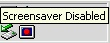



## SaverSwitch Screensaver Tray Control \(Updated\)

### Description

(NOTE: NEW BIGGER VERSION INCORPORATING ALL SUGGESTIONS AT http://www.planet-source-code.com/vb/scripts/ShowCode.asp?txtCodeId=43915&lngWId=1 -- I'm leaning this version up for those who want the smaller, simpler app)

Small icon in the systray disables, enables or runs the screensaver with a click. Also has a menu item to open the display properties control panel to the screensaver tab.

Tested w/ Win2000 and XP; please let me know if there are any problems on other OS's.

Thanks to all the PSC community... I wouldn't know half the tricks I do if it weren't for all of you.

UPDATE: Added option to LoadAtStartup (Registry method) and save this setting to Registry [fixed].
 
### More Info
 

             |
---                |---
**Submitted On**   |2003-03-06 13:28:10
**By**             |[Dan Redding \- Blue Knot Software](https://github.com/Planet-Source-Code/PSCIndex/blob/master/ByAuthor/dan-redding-blue-knot-software.md)
**Level**          |Intermediate
**User Rating**    |4.7 (14 globes from 3 users)
**Compatibility**  |VB 4\.0 \(32\-bit\), VB 5\.0, VB 6\.0
**Category**       |[Complete Applications](https://github.com/Planet-Source-Code/PSCIndex/blob/master/ByCategory/complete-applications__1-27.md)
**World**          |[Visual Basic](https://github.com/Planet-Source-Code/PSCIndex/blob/master/ByWorld/visual-basic.md)
**Archive File**   |[SaverSwitc155548362003\.zip](https://github.com/Planet-Source-Code/dan-redding-blue-knot-software-saverswitch-screensaver-tray-control-updated__1-43788/archive/master.zip)

